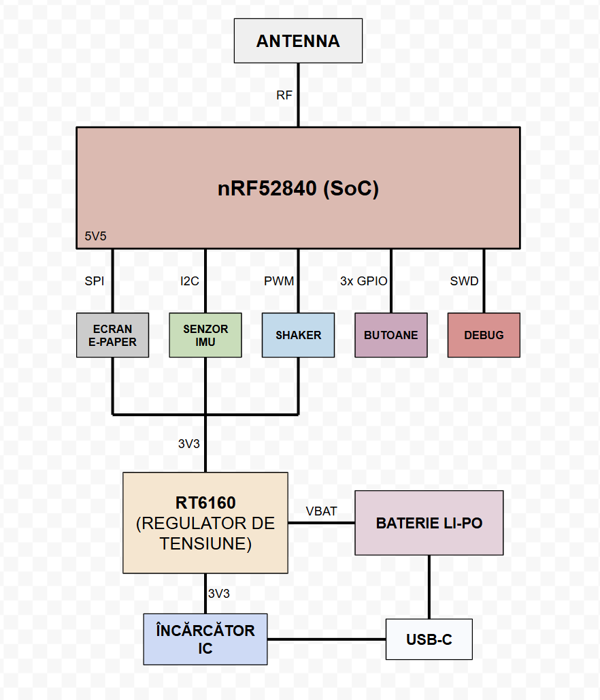

# InkTime - Smartwatch PCB Design

**Autor:** Radu Andreea
**Licenta:** Apache License 2.0 

## 1. Arhitectura sistemului

Sistemul este construit in jurul microcontroller-ului **nRF52840**, care gestioneaza comunicatia si perifericele.

Structura generala este urmatoarea:

## 2. BOM (Bill of Materials)

## CIRCUITE INTEGRATE (IC)

| Componentă | JLC Part # | Package | Descriere | Datasheet |
| :--- | :--- | :--- | :--- | :--- |
| IC1 | C3682423 | DSBGA-8 (1.6x1.1) | Încărcător baterie Li-Ion / Li-Polymer | [datasheet](https://www.ti.com/cn/lit/ds/symlink/bq25180.pdf) |
| IC2 | C81079 | DSBGA-9 | Driver haptic ERM/LRA | [datasheet](https://www.ti.com/cn/lit/gpn/drv2605) |
| IC3 | C189517 | LGA-12 (2x2) | Accelerometru 3 axe low-g 12bit | [datasheet](https://www.lcsc.com/datasheet/C189517.pdf) |
| IC9 | C7065276 | WLCSP-15B (2.3x1.4) | DC-DC buck-boost regulator I2C | [datasheet](https://wmsc.lcsc.com/wmsc/upload/file/pdf/v2/lcsc/2312271436_Richtek-Tech-RT6160AWSC_C7065276.pdf) |
| U1 | C3606653 | QFN-48 (6x6) | nRF52840 MCU | [datasheet](https://www.lcsc.com/datasheet/C3606653.pdf) |
| U2 | C2682616 | DFN-8-EP (2x2) | Fuel gauge baterie Li-Ion I2C | [datasheet](https://www.lcsc.com/datasheet/lcsc_datasheet_2410121738_Analog-Devices-Inc--Maxim-Integrated-MAX17048G-T10_C2682616.pdf) |

---

## CONECTORI

| Componentă | JLC Part # | Package | Descriere | Datasheet |
| :--- | :--- | :--- | :--- | :--- |
| J1 | C122434 | SMD, FFC/FPC 0.5mm | Conector FPC 24 pini, unghi drept | [datasheet](https://www.molex.com/content/dam/molex/molex-dot-com/products/automated/en-us/salesdrawingpdf/503/503480/5034802400_sd.pdf) |
| J2 | C90533 | 1mm pitch | Adaptor cablu 6 poziții | [datasheet](https://wmsc.lcsc.com/wmsc/upload/file/pdf/v2/lcsc/1810141506_LX-FFC6P1-0mm7CM_C90533.pdf) |
| J4 | C709357 | USB-C SMD | Conector USB Type-C 16P | [datasheet](https://www.lcsc.com/datasheet/lcsc_datasheet_2404191039_Shenzhen-Kinghelm-Elec-KH-TYPE-C-16P_C709357.pdf) |

---

## SEMICONDUCTORI

| Componentă | JLC Part # | Package | Descriere | Datasheet |
| :--- | :--- | :--- | :--- | :--- |
| Q1 | C2564 | TO-220AB | MOSFET P-channel 55V 74A | [datasheet](https://www.lcsc.com/datasheet/lcsc_datasheet_1809041724_Infineon-Technologies-IRF4905PBF_C2564.pdf) |
| Q3 | C469327 | SOT-323 | MOSFET N-channel 30V 1.5A | [datasheet](https://www.lcsc.com/datasheet/lcsc_datasheet_1912202016_Vishay-Intertech-SI1308EDL-T1-GE3_C469327.pdf) |
| D2, D4, D5 | C82046 | SOD-123 | Diodă Schottky 0.5A 30V | [datasheet](https://www.lcsc.com/datasheet/lcsc_datasheet_2304140030_onsemi-MBR0530T1G_C82046.pdf) |
| D3 | C2969755 | SOT-23-6L | Protecție ESD USB | [datasheet](https://wmsc.lcsc.com/wmsc/upload/file/pdf/v2/lcsc/2211080730_STMicroelectronics-USBLC6-2SC6Y_C2969755.pdf) |

---

## INDUCTORI

| Componentă | JLC Part # | Package | Descriere | Datasheet |
| :--- | :--- | :--- | :--- | :--- |
| L1, L2, L3 | C12669 | 0402 | Inductor general (chip inductor) | [datasheet](https://www.lcsc.com/datasheet/lcsc_datasheet_2304140030_Murata-Electronics-LQG15HS27NJ02D_C12669.pdf) |
| L5 | C1329646 | SMD 4.8x4.8mm | Power inductor 4.7µH 1.6A | [datasheet](https://wmsc.lcsc.com/wmsc/upload/file/pdf/v2/lcsc/2304140030_BOURNS-SRR4828A-4R7Y_C1329646.pdf) |
| L7 | C5832368 | 1008 | Power inductor 470nH 6.5A | [datasheet](https://wmsc.lcsc.com/wmsc/upload/file/pdf/v2/lcsc/2306021632_cjiang--Changjiang-Microelectronics-Tech-FTC252012SR47MBCA_C5832368.pdf) |

---

## CRISTALE

| Componentă | JLC Part # | Package | Descriere | Datasheet |
| :--- | :--- | :--- | :--- | :--- |
| X1 | C9009 | SMD3225-4P | Cristal Oscilator 32 MHz | [datasheet](https://www.lcsc.com/datasheet/lcsc_datasheet_2403291504_YXC-Crystal-Oscillators-X322532MOB4SI_C9009.pdf) |
| X2 | C32346 | SMD3215-2P | Cristal Oscilator 32.768 kHz | [datasheet](https://www.lcsc.com/datasheet/lcsc_datasheet_2404180925_Seiko-Epson-Q13FC13500004_C32346.pdf) |

---

## REZISTOARE

| Componentă | JLC Part # | Package | Descriere | Datasheet |
| :--- | :--- | :--- | :--- | :--- |
| R1_EP_DR | C3920633 | 0201 | 7.68kΩ Thin Film ±0.5% | [datasheet](https://wmsc.lcsc.com/wmsc/upload/file/pdf/v2/lcsc/2404081048_TE-Connectivity-CPF0201B511RE1_C3920633.pdf) |
| R1_USB, R2_USB | C3920633 | 0201 | 7.68kΩ Thin Film ±0.5% | [datasheet](https://wmsc.lcsc.com/wmsc/upload/file/pdf/v2/lcsc/2404081048_TE-Connectivity-CPF0201B511RE1_C3920633.pdf) |
| R2, R3, R4 | C3920633 | 0201 | 7.68kΩ Thin Film ±0.5% | [datasheet](https://wmsc.lcsc.com/wmsc/upload/file/pdf/v2/lcsc/2404081048_TE-Connectivity-CPF0201B511RE1_C3920633.pdf) |
| R2_EP_DR, R9, R_PWR_EPD | C3920633 | 0201 | 7.68kΩ Thin Film ±0.5% | [datasheet](https://wmsc.lcsc.com/wmsc/upload/file/pdf/v2/lcsc/2404081048_TE-Connectivity-CPF0201B511RE1_C3920633.pdf) |
| R5, R7, R8 | C3920633 | 0201 | 7.68kΩ Thin Film ±0.5% | [datasheet](https://wmsc.lcsc.com/wmsc/upload/file/pdf/v2/lcsc/2404081048_TE-Connectivity-CPF0201B511RE1_C3920633.pdf) |
| R17, R18 | C3920633 | 0201 | 7.68kΩ Thin Film ±0.5% | [datasheet](https://wmsc.lcsc.com/wmsc/upload/file/pdf/v2/lcsc/2404081048_TE-Connectivity-CPF0201B511RE1_C3920633.pdf) |
| R_TYPE_SEL | C3920633 | 0201 | 7.68kΩ Thin Film ±0.5% | [datasheet](https://wmsc.lcsc.com/wmsc/upload/file/pdf/v2/lcsc/2404081048_TE-Connectivity-CPF0201B511RE1_C3920633.pdf) |

---

## CAPACITORI

| Componentă | JLC Part # | Package | Descriere | Datasheet |
| :--- | :--- | :--- | :--- | :--- |
| C1, C2, C17, C18 | C9900156064 | 0201 | Generic chip capacitor | [datasheet](https://ds.yuden.co.jp/TYCOMPAS/or/download?pn=MLAST063SCG681JFNA01&fileType=CA) |
| C1-EP-DR | C9900156064 | 0201 | Generic chip capacitor | [datasheet](https://ds.yuden.co.jp/TYCOMPAS/or/download?pn=MLAST063SCG681JFNA01&fileType=CA) |
| C2-EP-DR | C9900156064 | 0201 | Generic chip capacitor | [datasheet](https://ds.yuden.co.jp/TYCOMPAS/or/download?pn=MLAST063SCG681JFNA01&fileType=CA) |
| C3, C4 | C9900156064 | 0201 | Generic chip capacitor | [datasheet](https://ds.yuden.co.jp/TYCOMPAS/or/download?pn=MLAST063SCG681JFNA01&fileType=CA) |
| C5, C7, C8, C12, C19 | C9900156064 | 0201 | Generic chip capacitor | [datasheet](https://ds.yuden.co.jp/TYCOMPAS/or/download?pn=MLAST063SCG681JFNA01&fileType=CA) |
| C6, C14, C20, C21 | C9900156064 | 0201 | Generic chip capacitor | [datasheet](https://ds.yuden.co.jp/TYCOMPAS/or/download?pn=MLAST063SCG681JFNA01&fileType=CA) |
| C9 | C9900156064 | 0201 | Generic chip capacitor | [datasheet](https://ds.yuden.co.jp/TYCOMPAS/or/download?pn=MLAST063SCG681JFNA01&fileType=CA) |
| C10, C13, C22 | C9900156064 | 0201 | Generic chip capacitor | [datasheet](https://ds.yuden.co.jp/TYCOMPAS/or/download?pn=MLAST063SCG681JFNA01&fileType=CA) |
| C11 | C9900156064 | 0201 | Generic chip capacitor | [datasheet](https://ds.yuden.co.jp/TYCOMPAS/or/download?pn=MLAST063SCG681JFNA01&fileType=CA) |
| C15 | C9900156064 | 0201 | Generic chip capacitor | [datasheet](https://ds.yuden.co.jp/TYCOMPAS/or/download?pn=MLAST063SCG681JFNA01&fileType=CA) |
| C16 | C9900156064 | 0201 | Generic chip capacitor | [datasheet](https://ds.yuden.co.jp/TYCOMPAS/or/download?pn=MLAST063SCG681JFNA01&fileType=CA) |
| C23, C27, C34, C42 | C21012218 | 0402 | Capacitor ceramic | [datasheet](https://jlc-prod-smt.oss-eu-central-1.aliyuncs.com/smtDataManualFile/8603520985945550848-C21012218.pdf) |
| C24, C39 | C9900179830 | 0402 | Capacitor ceramic | N/A |
| C25, C33 | C9900179830 | 0402 | Capacitor ceramic | N/A |
| C29, C30, C31, C32, C37, C38 | C3920633 | 0201 | Capacitor ceramic | [datasheet](https://ds.yuden.co.jp/TYCOMPAS/or/download?pn=MLAST063SCG681JFNA01&fileType=CA) |
| C43 | C9900156064 | 0201 | Generic chip capacitor | [datasheet](https://ds.yuden.co.jp/TYCOMPAS/or/download?pn=MLAST063SCG681JFNA01&fileType=CA) |
| EPD_C1, EPD_C2, EPD_C6, EPD_C7, EPD_C8, EPD_C9, EPD_C10, EPD_C11, EPD_C12 | C9900156064 | 0201 | Generic chip capacitor | [datasheet](https://ds.yuden.co.jp/TYCOMPAS/or/download?pn=MLAST063SCG681JFNA01&fileType=CA) |
| EPD_C5 | C9900156064 | 0201 | Generic chip capacitor | [datasheet](https://ds.yuden.co.jp/TYCOMPAS/or/download?pn=MLAST063SCG681JFNA01&fileType=CA) |

---

## ALTE COMPONENTE

| Componentă | JLC Part # | Package | Descriere | Datasheet |
| :--- | :--- | :--- | :--- | :--- |
| ANT1 | C2917717 | 1206 | Antenă Patch 2.4 GHz | [datasheet](https://www.lcsc.com/datasheet/lcsc_datasheet_2404021210_Johanson-Dielectrics-2450AT18B100E_C2917717.pdf) |
| SJ1 | N/A | Solder Jumper | SMD solder JUMPER (leave open) | N/A |
| SW_DN, SW_ENT, SW_UP | C569760 | SMD 3.9x2.9mm | Buton tactil SPST (Tactile Switch) | [datasheet](https://wmsc.lcsc.com/wmsc/upload/file/pdf/v2/lcsc/2301111010_PANASONIC-EVPAKE31A_C569760.pdf) |
| TP (Test Pads) | N/A | N/A | Puncte de testare (Test pads) | N/A |

## 3. Functionalitate hardware si specificatii tehnice

Proiectul **InkTime** reprezinta un dispozitiv wearable optimizat pentru consum redus de energie, capabil sa functioneze pe perioade lungi de timp datorita combinatiei dintre un microcontroller eficient si un display E-Ink, care consuma energie doar la actualizare.

---

### 3.1 Unitatea centrala (Microcontroller)

In centrul sistemului se afla circuitul **nRF52840**, care integreaza toate functiile principale:

* Procesor **ARM Cortex-M4F la 64 MHz**, suficient pentru procesare de semnale si control periferice
* Suport integrat pentru **Bluetooth Low Energy (BLE)**, utilizat pentru comunicarea cu telefonul
* Moduri de consum redus (sleep si deep sleep), unde curentul scade pana la nivel de microamperi

Acest microcontroller permite rularea simultana a comunicatiei wireless si a interactiunii cu senzorii, mentinand consumul scazut.

### 3.2 Sistem de alimentare

Alimentarea este realizata printr-un lant complet de power management:

* **BQ25180** – responsabil pentru incarcarea bateriei Li-Po prin USB-C, folosind metoda CC/CV si protectii integrate
* **RT6160** – convertor buck-boost care asigura o tensiune stabila de **3.3V**, chiar daca bateria scade sub aceasta valoare
* **MAX17048** – circuit de monitorizare a bateriei, care transmite starea de incarcare catre microcontroller prin I2C

Avantajul folosirii convertorului buck-boost este utilizarea eficienta a bateriei pe intreaga plaja de tensiuni.

### 3.3 Comunicatia intre module

Pentru conectarea componentelor, sistemul foloseste doua interfete principale:

#### Magistrala I2C

Este utilizata pentru perifericele inteligente:

* accelerometrul (IMU)
* fuel gauge-ul
* driverul haptic

Toate aceste componente sunt conectate pe aceeasi magistrala, ceea ce reduce numarul de pini folositi si simplifica traseele pe PCB.

#### Magistrala SPI

Este dedicata exclusiv display-ului:

* display-ul E-Ink este conectat prin SPI folosind conectorul FPC
* aceasta interfata permite transfer rapid de date necesar actualizarii imaginii

### 3.4 Interactiune cu utilizatorul

Dispozitivul include:

* 3 butoane pentru navigare (UP, ENTER, DOWN)
* feedback haptic realizat cu **DRV2605**, controlat prin PWM

Acest sistem permite interactiune intuitiva fara consum mare de energie.

### 3.5 Estimarea consumului de energie

Sistemul este alimentat de o baterie Li-Po de aproximativ **250 mAh**.

Consum estimat:

* Sleep (MCU + BLE): ~35 µA
* Functionare activa (citire senzori): ~120 µA
* Actualizare display: ~25 µA

Curent mediu total:

I_avg ≈ 180 µA = 0.18 mA

### 3.6 Autonomie estimata

Autonomia teoretica:

T = 250 mAh / 0.18 mA ≈ 1380 ore

In conditii reale (BLE, senzori, vibratii):

👉 aproximativ **9 – 14 zile**

## 4. Mapare pini nRF52840

### 4.1 Alocarea pinilor

| Componenta    | Semnal | Pin nRF | Directie | Motiv                |
| ------------- | ------ | ------- | -------- | -------------------- |
| Display E-Ink | SCK    | P0.11   | Output   | Clock SPI            |
| Display E-Ink | MOSI   | P0.12   | Output   | Transfer date        |
| Display E-Ink | CS     | P0.13   | Output   | Selectie dispozitiv  |
| Display E-Ink | DC     | P0.14   | Output   | Data / Command       |
| Display E-Ink | RESET  | P0.15   | Output   | Reset hardware       |
| Display E-Ink | BUSY   | P0.16   | Input    | Status display       |
| I2C           | SDA    | P0.26   | I/O      | Linie date           |
| I2C           | SCL    | P0.27   | Output   | Linie clock          |
| Buton UP      | GPIO   | P1.07   | Input    | Navigare             |
| Buton ENTER   | GPIO   | P1.08   | Input    | Confirmare           |
| Buton DOWN    | GPIO   | P1.09   | Input    | Navigare             |
| Motor haptic  | PWM    | P1.02   | Output   | Control vibratii     |
| RT6160        | EN     | P0.18   | Output   | Activare convertor   |
| IMU           | INT    | P0.25   | Input    | Intrerupere hardware |

---

### 4.2 Decizii de design

* **Port 0** a fost folosit pentru interfete rapide (SPI, I2C)
* **Port 1** a fost folosit pentru butoane, pentru a evita interferente
* pinii SPI au fost grupati fizic pentru trasee mai scurte
* magistrala I2C este comuna pentru mai multe dispozitive → economie de pini
* pinii NFC (P0.09, P0.10) au fost evitati pentru extensii viitoare

## 5. Design log si decizii de implementare

### 5.1 Layout PCB

* componentele au fost plasate compact
* traseele de alimentare au fost facute la **0.3 mm**
* traseele de semnal la **0.15 mm**
* zona antenei a fost lasata fara cupru

### 5.2 Probleme si solutii

* componente 0201 → necesare pentru spatiu redus
* routing dificil sub MCU → s-au folosit trasee mai subtiri local
* antena → zona keep-out pentru performanta RF

### 5.3 Integritate semnal

* condensatori de decuplare (100nF) plasati foarte aproape de pini
* GND realizat cu polygon pour pe ambele straturi
* via stitching pentru masa

## 6. Randari si imagini

(Imaginile se gasesc in folderul `Images`)

* vedere PCB top
* vedere PCB bottom
* randare 3D
* vedere explodata
